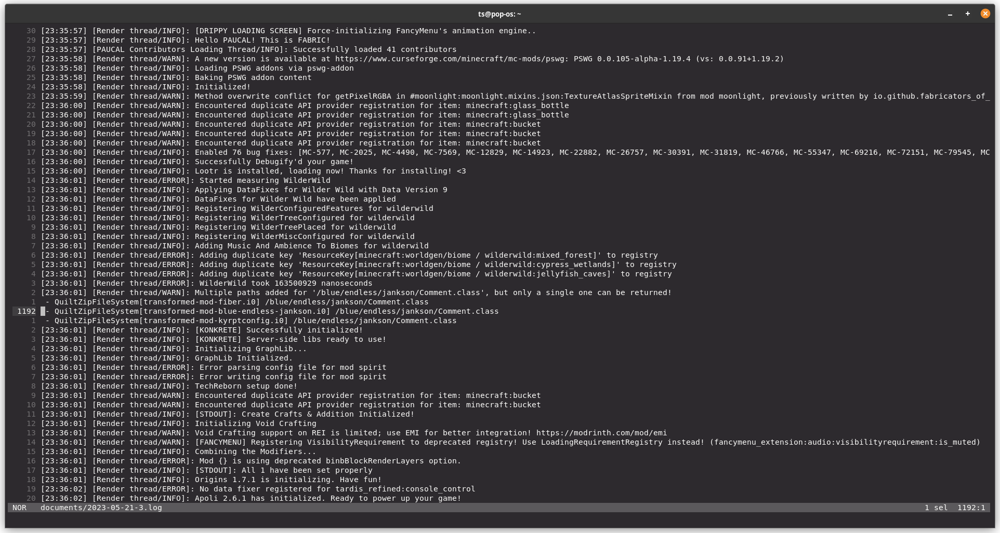
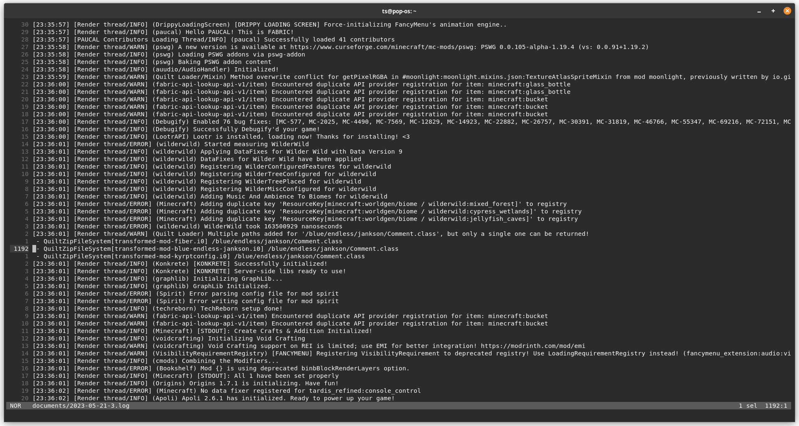

# Better Log4j Config

A simple mod for [Quilt](https://quiltmc.org) to automatically reconfigure [Log4j](https://logging.apache.org/log4j/2.x/index.html) to improve the formatting of log messages.

## Screenshots

### Before

### After

## What does it do?

As can be seen from the above screenshots, the main difference this mod makes is the addition of the name of the mod responsible for each log message.

This small change makes logs significantly more readable, as without it there is no reliable way to distinguish between log messages from different mods.

The screenshots also highlight how some mods attempt to individually remedy this issue by manually including their name in the content of the log message.

This mod offers a solution to this problem by configuring the logging system itself to always include the mod name in the log messages.

The format of the log messages can also be further customised with a [config file](https://logging.apache.org/log4j/2.x/manual/configuration.html#XML), which by default is `better_log4j_config.xml` in the mod config directory.

## License

Better Log4j Config is licensed under the [Apache 2.0 license](./LICENSE).
